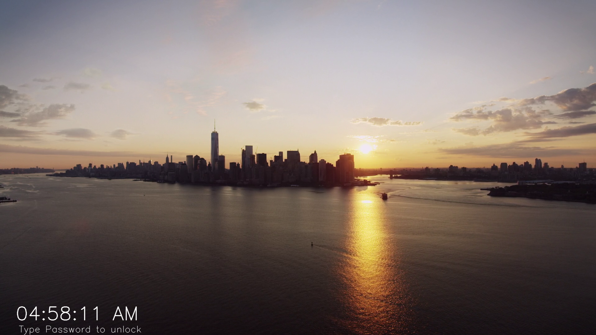
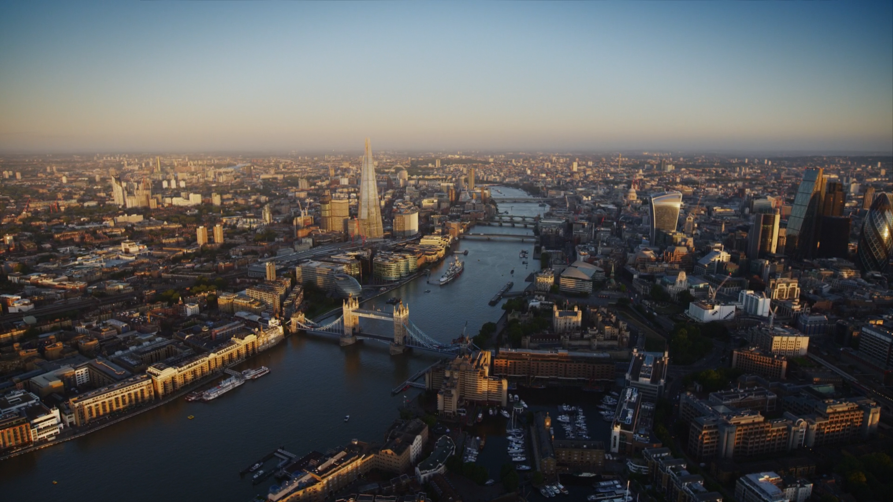

### Screenlocker

> See Aerial shots as screensaver

<p align="center">
 
 
 
</p>

# Dependencies

-   Python
-   Rust

# How to install

```sh
pip install opencv-python tk pynput playsound pathlib pyautogui
git clone https://github.com/glowfi/screenlocker
cd screenlocker
cargo build --release
```

# Binary Location

Afer Building with rust binary will be stored at :

```
target/release/screenlocker
```

# Instructions

-   After Building run the screenlocker alteast once to save your password.
    Then you can make a custom script to automatically run this binary after some minutes of inactivity.

    -   For example in Linux you can use xautolock like below :

    ```sh
     xautolock -time 10 -locker ~/.local/bin/screenlocker &
    ```

-   After 10 minutes of inactivity this screenlocker will be invoked.
