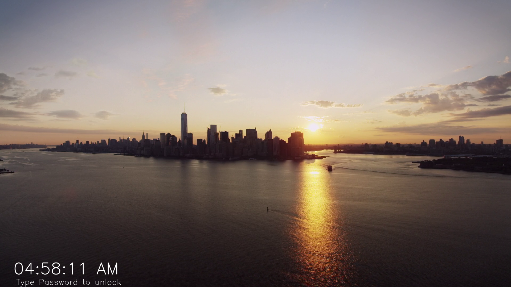
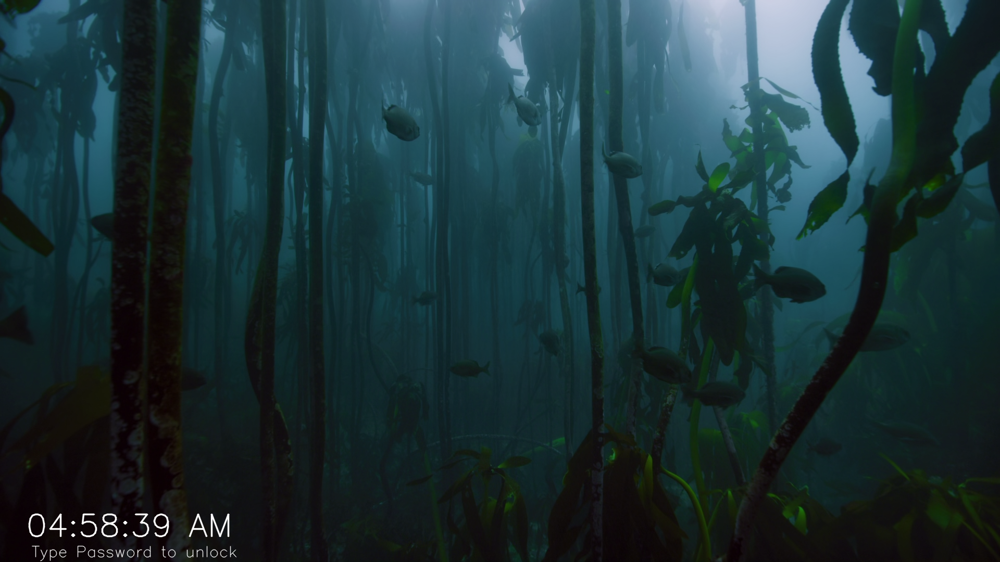
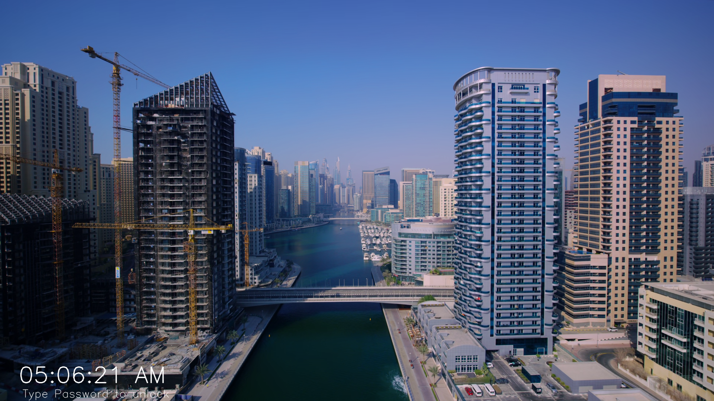
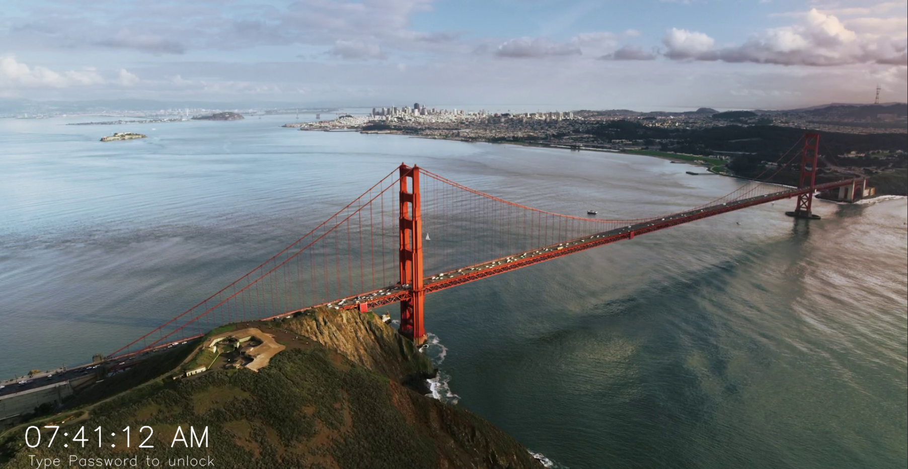

### SCREENLOCKER

> See Different Aerial shots as screensaver

More 50+ Aerial videos

# DEMO






# DEPENDENCIES

-   Python
-   Rust

# INSTALL

```
pip install opencv-python tk pynput playsound pathlib pyautogui
git clone https://github.com/glowfi/screenlocker
cd screenlocker
cargo build
```

# Binary Location

```
Afer Building with rust binary will be stored at :

target/debug/screenlocker
```
